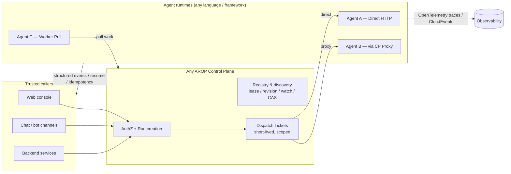

<div align="center">

# AROP — Agent Runtime Operations Protocol

**The open, vendor-neutral protocol for operating AI agents in production.**

Publish · Register · Authorize · Dispatch · Stream · Trace · Audit · Upgrade · Retire —
one contract for agents in any language, on any framework, in any deployment.

[English](README.md) · [简体中文](README.zh-CN.md)

[](LICENSE)
[](docs/DEVELOPMENT_PLAN.md)
[](spec/artifact-manifest.yaml)
[](docs/SDK_AND_DX.md)
[](docs/INTEROPERABILITY.md)
[](CONTRIBUTING.md)

</div>

---

## Why AROP exists

AI agents are moving into production, and every platform is reinventing the same plumbing: how an agent gets published, discovered, authorized, scheduled, streamed, observed, upgraded, and retired. The result is a landscape of incompatible agent runtimes where every enterprise integration is bespoke.

The emerging protocol stack covers everything *except* operations:

| Layer | Standard | What it solves | What it leaves open |
| --- | --- | --- | --- |
| Tools & resources | **MCP** (Model Context Protocol) | How an agent reaches tools, files, and context | Who may run the agent, and how |
| Agent ↔ agent | **A2A** (Agent-to-Agent) | How agents talk to each other | How either agent is deployed and governed |
| Public discovery | **ARD / AI Catalog** | How agents are found across domains | How they are invoked and operated |
| Events & traces | **CloudEvents / OpenTelemetry** | Wire formats for events and telemetry | Agent-specific run and delivery semantics |
| **Runtime operations** | **AROP (this project)** | **Publishing, registry, authorization, dispatch, streaming runs, reliability, audit, lifecycle** | — |

AROP is the missing **agent runtime and operations interoperability layer**. It does not replace MCP, A2A, ARD/AI Catalog, CloudEvents, or OpenTelemetry — it composes with them, and it does not prescribe any agent framework.

## Core ideas

- **One contract for every agent.** Agents written in any language, on any framework, deployed anywhere, speak the same onboarding contract. Web consoles, chat/bot channels, and backend services all invoke the same `AgentDefinition`.
- **Control-plane-authorized Runs.** Every new invocation is authorized by a Control Plane and materialized as a Run before any agent executes — the basis for quota, audit, and replayable history.
- **Dispatch Tickets.** After authorization, trusted callers hold a short-lived, scoped ticket and talk to the agent directly. Business traffic does not have to flow through a console.
- **Three delivery modes.** Direct HTTP, Control-Plane Proxy, and in-network Worker Pull cover public services, brokered access, and agents behind firewalls with no inbound connectivity.
- **Streaming-native reliability.** Protocol v1 natively specifies structured streaming events, disconnect resume, idempotency keys, leases, retries, and end-to-end tracing — not as add-ons, but as first-class protocol state machines.
- **A registry built on proven ideas.** Registration and discovery adopt the Lease, Revision, Watch, CAS, and health-view concepts proven by etcd and Nacos — implemented independently, with no dependency on either.
- **Layered adoption.** The protocol is split into Core, Runtime Management, Delivery, Streaming, and Governance layers. Implementers adopt what they need; nobody is forced to implement everything.
- **Independently implementable.** Any third party can build a compatible Control Plane or Runtime from the spec and conformance suite alone. The reference implementation is one implementation, never the definition of correctness.

## Architecture at a glance



## What's in this repository

| Area | Path | Contents |
| --- | --- | --- |
| Protocol spec | [`docs/`](docs/PROTOCOL_SPECIFICATION.md), [`spec/`](spec/artifact-manifest.yaml) | Normative specifications, decision ledger, immutable requirements, machine-readable artifact catalog |
| Structures | `schemas/` | JSON Schema (Draft 2020-12 portable subset) for manifests, registry, runs, events, streaming |
| Transport bindings | [`openapi/`](openapi/agent-runtime-v1.yaml), [`asyncapi/`](asyncapi/agent-events-v1.yaml) | OpenAPI and AsyncAPI bindings derived from the schemas |
| Golden examples | [`examples/`](examples/manifests/valid/minimal.yaml) | Valid and adversarial fixtures used by the conformance suite |
| Conformance | [`conformance/`](conformance/profiles/v1/production.yaml) | Provider- and consumer-side contract tests and profiles |
| SDKs | `sdk/` | Go, Python, and TypeScript SDKs generated from the spec by a deterministic, offline pipeline |
| Reference | `reference/` | Lightweight reference Control Plane, reference agents, and worker adapters |
| Interop adapters | `adapters/` | MCP, A2A, ARD, CloudEvents, and OpenTelemetry bridges |
| RFCs | [`rfcs/`](rfcs/README.md) | Public RFC process for normative changes |

The single machine-readable catalog of current and planned artifacts is [`spec/artifact-manifest.yaml`](spec/artifact-manifest.yaml).

## Spec-first engineering, verifiable by machine

AROP is built spec-first with an explicit authority chain:

```text
DECISIONS → domain specs & state-machine fixtures → JSON Schema → OpenAPI / AsyncAPI
```

SDK models, reference implementations, and generated docs are derivatives and can never redefine the spec.

The repository enforces itself: `make validate` checks the authority chain, the machine-readable artifact DAG, the immutable requirements, decision IDs, and local reference closure on every change. Every development phase produces an evidence-bound report pinned to exact commit, input digests, and checker digest, re-verifiable by an independent verifier. Release trust is anchored in a TUF-style signed role registry with Ed25519 thresholds and Sigstore (Fulcio/Rekor) verification — approvals are verified, never synthesized.

## Quick start

```bash
git clone https://github.com/gmslll/agent-runtime-operations-protocol.git
cd agent-runtime-operations-protocol

npm ci --ignore-scripts --omit=optional --no-audit --no-fund
make validate
```

Compute a canonical manifest digest:

```bash
make manifest-digest FILE=examples/manifests/valid/minimal.yaml
```

Node.js is used only for schema, fixture, and docs validation — the public reference Control Plane and server-side components are Go; Python powers the provider SDK and reference agents.

## Documentation

Recommended reading order:

1. [Architecture](docs/ARCHITECTURE.md)
2. [Protocol specification](docs/PROTOCOL_SPECIFICATION.md)
3. [Registry & discovery](docs/REGISTRY_AND_DISCOVERY.md)
4. [Runs, events & streaming](docs/RUN_AND_STREAMING.md)
5. [Security & governance](docs/SECURITY_AND_GOVERNANCE.md)
6. [Reliability & operations](docs/RELIABILITY_AND_OPERATIONS.md)
7. [SDKs & developer experience](docs/SDK_AND_DX.md)
8. [Interoperability with external standards](docs/INTEROPERABILITY.md)
9. [Public project & adoption strategy](docs/PUBLIC_PROJECT_AND_ADOPTION.md)
10. [Final repository layout](docs/DIRECTORY_STRUCTURE.md)
11. [Implementation blueprint](docs/IMPLEMENTATION_BLUEPRINT.md)
12. [P01–P53 development & release plan](docs/DEVELOPMENT_PLAN.md)
13. [Architecture decisions & release configuration](docs/DECISIONS.md)
14. [Machine-readable artifact catalog](spec/artifact-manifest.yaml)
15. [Immutable requirements](spec/requirements.yaml)
16. [Conflict resolution ledger](spec/conflicts.yaml)

## Status & roadmap

AROP is a **Protocol v1 planning candidate**, developed in the open from day one of its public history. The first schemas, fixtures, and the Go tooling baseline are in place; the specification is still subject to its independent planning audit and owner gates before any directory restructuring or new protocol behavior lands. The first public release candidate will be `v1.0.0-rc.N`, cut from a clean source commit — there is no separate public v0.1.

This repository — [`gmslll/agent-runtime-operations-protocol`](https://github.com/gmslll/agent-runtime-operations-protocol) — is the canonical public home (public since 2026-10-03). Release-evidence trust identities are const-bound to it; externally held trust artifacts minted under any historical identity are rejected by the verifiers and must be re-issued. The project domain and package-registry ownership remain real external gates tracked in [the development plan](docs/DEVELOPMENT_PLAN.md); schema `$id`s use the reserved placeholder domain `arop.invalid` until the public domain is finalized.

> **项目状态（中文权威说明）**
> 当前是 **Protocol v1 规划候选**：P01 权威/元数据基线与 P02 可调度蓝图候选已完成，正在等待 P03 重新独立审计和 P04 用户明确确认；此前不执行目录重构或新协议行为实现。现有首批 Schema、Fixture 和 Go 基线仅是起点，不表示规划已冻结或 v1 已可发布。
> 协议仓不依赖 Console、飞书、cc-connect、Teable 或具体 Agent 框架；任意第三方可以独立实现兼容 Control Plane 或 Runtime。取消独立公共 v0.1，首个公开候选是从 clean source commit 发布的 `v1.0.0-rc.N`。
> 不可变需求的权威原文是 [`spec/requirements.yaml`](spec/requirements.yaml) 中的 `statement_original_zh`；文档中的英文内容为非权威翻译。

Document markers used across the spec:

- **已确认 (Confirmed)** — a basis for implementation in this phase.
- **实现默认值 (Implementation default)** — adjustable through compatible configuration; adjusting requires updating docs and contract tests.
- **发布配置待填写 (Release configuration pending)** — no design disagreement, but real accounts, domains, or maintainer identities must be filled in before public release.

## Relationship to the Console

This protocol repository owns the stable, implementation-agnostic contracts, SDKs, conformance suite, and reference implementation. A production console (identity, catalog review, dispatcher implementation, usage, audit, channel integrations, admin UI) is a *consumer* of this protocol. The protocol defines how any Control Plane talks to agents, workers, and trusted callers — it never implements a console's business rules or database, and the spec does not depend on any console. 协议仓不依赖 Console，金运 Console 只是其中一个实现，不是协议正确性的唯一来源。

## Contributing

Normative changes go through the public [RFC process](rfcs/README.md) and require two maintainer reviews; the project uses DCO (no CLA). Start with [CONTRIBUTING.md](CONTRIBUTING.md) and the [Code of Conduct](CODE_OF_CONDUCT.md). Security issues go through the private channel described in [SECURITY.md](SECURITY.md) — never through public issues.

If the direction resonates — an open operations layer for AI agents, verifiable down to its own build reports — **star the repo** to follow the road to `v1.0.0-rc`.

## License

[Apache-2.0](LICENSE)
